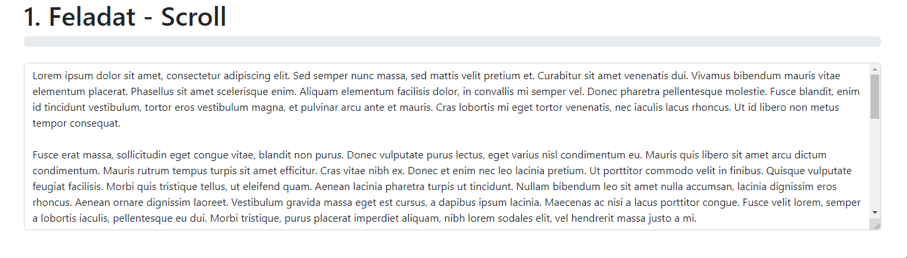

# Kliensoldali webprogramozás csoportzh - Progresszív fejlesztés

*2023.03.23.*

*Tóta Dávid*

[KERETPROGRAM](hallgatoknak.zip)

## Tudnivalók

A feladat beküldésével az alább leírtakat megértettnek és elfogadottnak tekintjük annak a nevében, aki a megoldást beküldte.

> `<Hallgató neve>`
> `<Neptun kódja>`
> 
> Ezt a megoldást a fent írt hallgató küldte be és készítette a Kliensoldali webprogramozás kurzus csoport ZH-jához.
> 
> Kijelentem, hogy ez a megoldás a saját munkám. Nem másoltam vagy használtam harmadik féltől származó megoldásokat. Nem továbbítottam megoldást hallgatótársaimnak, és nem is tettem közzé. Az Eötvös Loránd Tudományegyetem Hallgatói Követelményrendszere (ELTE szervezeti és működési szabályzata, II. Kötet, 74/C. §) kimondja, hogy mindaddig, amíg egy hallgató egy másik hallgató munkáját - vagy legalábbis annak jelentős részét - saját munkájaként mutatja be, az fegyelmi vétségnek számít. A fegyelmi vétség legsúlyosabb következménye a hallgató elbocsátása az egyetemről.

### 1. Feladat - Scroll (6 pont)

A `1-scroll/index.html` oldal két részből áll: felül található egy progress bar, alatta pedig egy textarea. A textarea alapértelmezés szerint ki van töltve mintaadatokkal, de ez tetszés szerint változtatható a tesztelés során. A progress bar alapértelmezés szerint 0%-os állapotban van. A progress bar állapotát az határozza meg, hogy milyen mértékben görgettük le a textarea tartalmát.

- Hozz létre egy eseményt, ami a görgetés eseményét kezeli a textarea elemen.
- Számold ki egy konstansba, hogy hány %-os a görgetés mértéke. (3 pont)
- Írd ki a százalékot a console-ra. (0.5 pont)
- Állítsd be a progress bar százalékát a számolt értékre: módosítsd a style.width tulajdonságát, ill. a progress bar szövegét is. (1 pont)
- Ha a görgetés mértéke legalább 80%-os, akkor állítsd be a progress bar színét zöldre (Bootstrap-ben `bg-success`). (1.5 pont)

Minta:

### 2. Feladat - Képek homályosítása (7 pont)

A `2-blur/index.html` oldal a macskákról szól, néhány képpel illusztrálva. A feladatod, hogy **Intersection Observer** segítségével oldd meg azt, hogy a képek élesek legyenek, amennyiben a teljes kép a viewportban van, és legyenek homályosak, ha csak egy részük látható (tehát a képnek csak egy része van a viewportban).

Tipp: a `blur` CSS osztályt használd a homályosításhoz. Ez már készen van a `2-blur/style.css` fájlban.

- Homályosítsd el az összes képet JavaScript segítségével (azaz ne a HTML-ben legyenek benne a `blur` osztályok). (1 pont)
- Készítsd el az `IntersectionObserver`-t a megfelelő paraméterekkel. (4 pont)
- Az `IntersectionObserver`-t használd a képek homályosítására. (2 pont)

Minta:

### 3. Feladat - Időzített linkek (7 pont)

A `3-timer/index.html` oldalon találhatók linkek (Bootstrap button-ok). Készíts ezekhez a linkekhez egy olyan **komponenst**, amely lehetővé teszi, hogy azok csak egy adott időtartam után legyenek kattinthatóak.

- Hozd létre a `TimerButton` komponenst. (1 pont)
- Ha nincs megadva a `timer` attribútum, akkor az alapértelmezett értéke legyen 5 másodperc. Ha a `timer` értéke kisebb 1-nél, akkor ne történjen semmi. (1 pont)
- Ha a `disabled` osztály eleve a gombon van, akkor ne történjen semmi. (0.5 pont)
- Rendeld hozzá a `disabled` osztályt a gombhoz. (0.5 pont)
- Valósíts meg egy időzítőt, ami a megadott időtartam után eltávolítja a `disabled` Bootstrap osztályt a gombból. (1 pont)
- Minden másodpercben frissítsd a gomb szövegét, hogy a maradék időt mutassa. Fontos, hogy ez gombonként eltérő érték is lehet, hiszen komponensekkel dolgozunk! (3 pont)

Minta:

